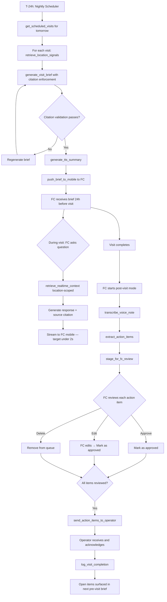

# AI Field Consultant Agent Blueprint

**Use case:** Franchise operations — augmenting field consultant visits with pre-visit intelligence, in-visit Q&A, and post-visit action routing.

---

## Agent Goal

Synthesise all available operational signals for a scheduled franchise location visit, deliver a cited pre-visit brief 24 hours before the visit, enable real-time location-scoped Q&A during the visit, and structure post-visit voice notes into tracked action items — with FC approval before any action item is delivered to the franchisee operator.

---

## Inputs

- Scheduled visit calendar (from franchise management platform)
- Location ID (maps to all indexed signals for that location)
- FC identity (determines scope, routing, and approval preferences)
- Signal data (LMS completion, mystery shop, support tickets, sales performance, prior visit notes) — all pre-indexed

**Runtime inputs (in-visit):**
- FC voice query (natural language question during visit)

**Post-visit inputs:**
- FC voice note recording (captured via mobile app)

---

## Tools Available

| Tool | Description | Autonomy |
|---|---|---|
| get_scheduled_visits(fc_id, date) | Retrieve FC's scheduled visits for a date | Automatic |
| retrieve_location_signals(location_id, signal_types, time_range) | Retrieve indexed signals for a location | Automatic |
| generate_visit_brief(location_id, retrieved_signals) | Generate pre-visit brief with citation enforcement | Automatic |
| generate_tts_summary(brief_text) | Convert brief text to audio | Automatic |
| push_brief_to_mobile(fc_id, brief_object) | Push brief to FC's mobile app | Automatic |
| retrieve_realtime_context(location_id, query) | Location-scoped RAG for in-visit Q&A | Automatic |
| transcribe_voice_note(audio_file) | Transcribe FC post-visit voice recording | Automatic |
| extract_action_items(transcript) | Extract structured action items from transcript | Automatic |
| stage_for_fc_review(fc_id, action_items) | Stage action items in FC's review queue | Automatic |
| send_action_items_to_operator(location_id, action_items) | Deliver approved action items to franchisee | Requires FC approval |
| log_visit_completion(location_id, visit_record) | Log completed visit to franchise platform | Automatic |

---

## Memory Model

| Memory Type | Content | Storage |
|---|---|---|
| In-context (brief generation) | Retrieved signal chunks for the location visit | LLM context window; discarded after brief generation |
| In-context (in-visit Q&A) | Location-scoped signal chunks + session history | LLM context window; persisted per session |
| External index | All signal chunks indexed by location_id, signal_type, date | Vector store + metadata index |
| Persistent session | Visit state (brief delivered, in-visit session active, post-visit review pending) | External database |
| Audit log | All agent actions, approvals, and timestamps | Append-only audit log |

---

## Retrieval Sources

**Pre-visit brief:**
- LMS API → training completion data (indexed by location, module, date)
- Mystery shop API → audit scores and trend (indexed by location, period)
- Support ticket system → ticket volume and top categories (indexed by location, issue type, date)
- Sales data API → sales performance vs. network average (indexed by location, period)
- Prior visit notes → action items and key themes from last 2 visits (indexed by location, visit date)

**In-visit Q&A:**
- Same sources as pre-visit, scoped to location_id only
- Retrieval window: last 90 days (configurable)
- Top-5 retrieved chunks per query (for latency optimisation)

**Post-visit action extraction:**
- No retrieval — extraction from the voice transcript only
- Retrieved signal context from the pre-visit brief is not re-used in extraction (extraction is solely from the FC's spoken commitments)

---

## Decision Logic

**Pre-visit brief flow (T-24 hours):**
```
1. get_scheduled_visits(fc_id, tomorrow)
2. For each visit:
   a. retrieve_location_signals(location_id, all_types, last_90_days)
   b. generate_visit_brief(location_id, signals)
      → Citation validation: reject if any claim uncited; re-generate
   c. generate_tts_summary(brief_text)
   d. push_brief_to_mobile(fc_id, {brief, audio_summary})
3. Log: brief_generated, brief_pushed, timestamp
```

**In-visit Q&A flow (real-time):**
```
1. FC triggers voice query (mobile app)
2. retrieve_realtime_context(location_id, query) → top-5 chunks
3. Generate response: 1–3 sentences + source citation
4. Stream to FC mobile app
5. Log: query, response, latency
Target: <2s p95 response time
```

**Post-visit action routing flow:**
```
1. FC ends visit, triggers post-visit mode
2. transcribe_voice_note(audio_file)
3. extract_action_items(transcript)
   → Output: array of action_item objects
4. stage_for_fc_review(fc_id, action_items)
5. FC reviews: approve / edit / delete per action item
6. On FC approval: send_action_items_to_operator(location_id, approved_items)
7. log_visit_completion(location_id, {brief_id, action_items, fc_approval_timestamp})
```

---

## Human Approval Points

| Decision Point | Autonomy | Rationale |
|---|---|---|
| Brief generation and push | Automatic | Brief is for FC consumption only; FC interprets and decides how to use it |
| In-visit Q&A response | Automatic | Real-time; FC applies judgment to the response |
| Action item extraction | Automatic | Extraction produces a draft, not a final |
| Action item review | FC must approve each item | FC owns the operator relationship; no items send without FC sign-off |
| Operator delivery | Requires FC approval | Customer-facing; non-negotiable HITL |
| Automated reminders to operator | Automatic (templated) | Reminders are pre-approved templates, not AI-generated per-operator content |

---

## Autonomy Level

**Current design (Recommended start):** Level 2 — Draft and wait for approval

- Agent automatically generates briefs and pushes them
- Agent automatically extracts action items and stages them for review
- Agent waits for FC approval before any operator-facing communication

**Future state (after 6 months of validated performance):** Level 3 candidate — Execute with notification

- Low-priority action items (e.g., "Review training module X — due in 30 days") could execute with FC notification rather than explicit approval
- High-priority or operator-response-required items remain at Level 2

---

## Failure Modes

| Failure Mode | Description | Detection | Mitigation |
|---|---|---|---|
| Brief generation with hallucinated claims | Model generates a claim not grounded in retrieved data | Citation validation check | Re-generate on citation failure; log for human review if re-gen fails |
| Stale data in brief | Signal data is >48 hours old | Data freshness timestamp check at brief generation | Display freshness alert in brief; log staleness event |
| Voice transcription error | Noisy environment produces inaccurate transcript | FC self-reports in review interface | FC review step catches errors before operator delivery |
| In-visit Q&A latency spike | Response time exceeds 2 seconds | Real-time latency monitoring | Fallback to faster model; surface latency alert to FC with "response may be slower than usual" |
| Action item over-extraction | Agent extracts items from casual conversation, not real commitments | FC override rate (precision metric) | Extraction prompt explicitly instructs: extract only explicit commitments |
| FC review queue abandonment | FC does not review action items within 48 hours | Time-in-queue metric | Reminder notification at T+12h, T+24h; escalate to ops director at T+48h |

---

## Guardrails

- **Citation enforcement (brief):** Every factual claim requires a source. Claims without sources are rejected. FC is never shown an uncited claim without an explicit "unverified" flag.
- **Location data scoping:** In-visit Q&A retrieval is hard-scoped to the current visit's location_id. Cross-location retrieval is not available in in-visit mode.
- **Operator communication gate:** send_action_items_to_operator is gated at the tool layer by fc_approval_token. The tool call fails without a valid token. This is enforced server-side, not only in the UI.
- **Voice data handling:** Audio files are processed and discarded within 30 minutes. Transcripts are retained per data retention policy.
- **Operator data access:** FC can access signal data only for locations in their assigned portfolio. Operations directors can access all location data.

---

## Success Metrics

| Metric | Target | Measurement |
|---|---|---|
| Brief delivery rate | >99% of scheduled visits receive brief before visit time | Operational monitoring |
| Brief open rate | >80% of FCs open brief before visit | App event tracking |
| Citation accuracy | >95% of cited claims verified | Monthly human eval (30 brief sample) |
| In-visit Q&A latency | <2s p95 | Real-time latency monitoring |
| Action item precision | >90% of extracted items correspond to real commitments (FC does not delete) | FC delete rate as precision proxy |
| FC approval lag | Median <2 hours from visit end to items approved | Session timestamp tracking |
| Operator acknowledgment rate | >75% of items acknowledged within 48 hours | Operator in-app tracking |

---

## Mermaid Diagram



---

*See also: [AI Field Consultant PRD](/ai-prds/ai-field-consultant-prd.md) · [AI Field Consultant Case Study](/case-studies/ai-field-consultant-franchise-ops.md) · [HITL Design Framework](/hitl-governance/human-in-the-loop-design.md)*
