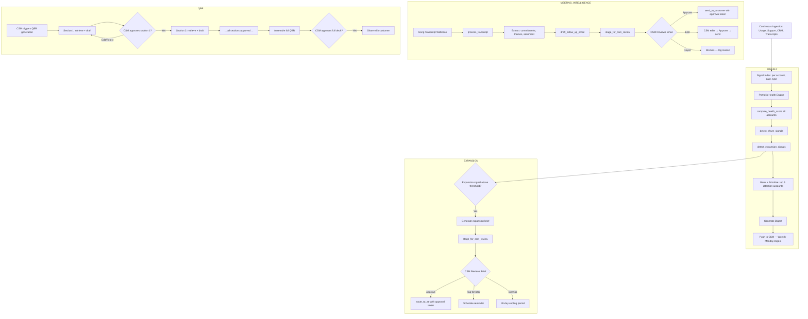

# Customer Success Intelligence Agent Blueprint

**Use case:** Customer success — continuous health monitoring, churn detection, expansion signals, meeting intelligence, and QBR automation with CSM approval for all customer-facing actions.

---

## Agent Goal

Monitor the health of a CSM's account portfolio continuously, surface the most important findings per account per week in a digestible digest, draft QBRs and follow-up emails from meeting transcripts, route expansion signals to the appropriate team member — with CSM approval required before any customer-facing content is delivered.

---

## Inputs

**Continuous (automated):**
- Product usage data (daily ingestion from analytics platform)
- Support ticket updates (real-time via webhook)
- CRM updates (daily ingestion: opportunity status, account notes, renewal dates)
- Call transcripts (post-meeting via Gong/Chorus webhook)

**On-demand (CSM-triggered):**
- QBR generation request: account_id, qbr_date, optional_focus_areas
- Account intelligence card request: account_id

---

## Tools Available

| Tool | Description | Autonomy |
|---|---|---|
| get_portfolio(csm_id) | Get all accounts in CSM's portfolio | Automatic |
| compute_health_score(account_id) | Run composite health score calculation | Automatic |
| detect_churn_signals(account_id) | Check account against churn pattern library | Automatic |
| detect_expansion_signals(account_id) | Check account for expansion pattern matches | Automatic |
| retrieve_account_context(account_id, time_range) | Full RAG retrieval for account | Automatic |
| process_transcript(transcript_id) | Extract commitments, themes, sentiment from call | Automatic |
| draft_follow_up_email(account_id, transcript_id) | Draft post-meeting follow-up | Automatic |
| draft_qbr_section(account_id, section_type) | Draft one QBR section | Automatic |
| stage_for_csm_review(csm_id, content_object) | Stage drafted content for CSM review | Automatic |
| send_to_customer(account_id, content_id, csm_approval_token) | Deliver approved content to customer | Requires CSM approval |
| route_to_ae(account_id, expansion_brief_id, csm_approval_token) | Route expansion signal to AE | Requires CSM approval |
| update_crm_note(account_id, note_content, csm_approval_token) | Update CRM account note | Requires CSM approval |
| schedule_reminder(csm_id, account_id, reminder_text, due_date) | Create reminder in CSM's task system | Automatic |

---

## Memory Model

| Memory Type | Content | Storage |
|---|---|---|
| In-context (health scoring) | Retrieved signals for one account; discarded after scoring | LLM context window |
| In-context (QBR generation) | Full account context assembled for QBR; per-section windows | LLM context window per section |
| External index | All signals chunked, embedded, indexed by account_id, signal_type, date | Vector store + metadata index |
| Health score time series | Composite health score per account, calculated daily | Time-series database |
| Expansion signal log | All detected expansion signals with timestamp and pattern_id | Structured log |
| Churn signal log | All detected churn signals with timestamp and severity | Structured log |
| Approval log | All CSM approvals, edits, and dismissals | Append-only audit log |

---

## Retrieval Sources

**Health scoring:**
- Product usage index: usage metrics, feature adoption, session frequency, last-seen date
- Support index: ticket volume (last 30 days), open P1/P2 tickets, CSAT trend
- CRM index: engagement frequency (calls, emails, last contacted), renewal proximity, NPS score
- Meeting index: call frequency, sentiment trend, competitor mentions

**QBR generation:**
- All indexed sources for the account, full 90-day retrieval window
- Prior QBR notes (if any prior QBR is indexed)
- Goals documented in CRM notes

**Follow-up email drafting:**
- Transcript for the specific call
- Account context: recent open items from prior calls, current health score
- Contact name and role from CRM

**Expansion signal detection:**
- Usage index: depth signals (heavy use of feature X, which maps to adjacent use case Y)
- CRM index: company headcount changes, job postings referencing the platform
- Meeting index: expansion-adjacent keywords ("we're expanding to the EMEA team", "we've started using X more than before")

---

## Decision Logic

**Portfolio health digest (weekly, Monday morning):**
```
1. get_portfolio(csm_id) → all account_ids
2. For each account:
   a. compute_health_score(account_id) → composite score + direction
   b. detect_churn_signals(account_id) → churn_flags[]
   c. detect_expansion_signals(account_id) → expansion_flags[]
3. Rank accounts by:
   a. Health score decline magnitude (largest week-over-week drop first)
   b. Open churn flags
   c. New expansion signals
4. Generate digest: top 5 accounts requiring attention + any new churn flags + new expansion signals
5. stage_for_csm_review(csm_id, digest_object)
6. Push to CSM (email + in-app notification)
```

**Meeting intelligence flow (post-call trigger):**
```
1. Transcript available event (Gong webhook)
2. process_transcript(transcript_id)
   → Extract: commitments[], open_items[], sentiment_score, topics[], competitor_mentions[]
3. draft_follow_up_email(account_id, transcript_id)
   → Draft: 3–5 sentence email with commitments and next steps
4. stage_for_csm_review(csm_id, {follow_up_email_draft, extracted_commitments})
5. CSM reviews: approve / edit / reject each element
6. On approval: send_to_customer OR schedule_reminder (depending on email type)
```

**QBR generation flow (CSM-triggered):**
```
1. CSM triggers: generate_qbr(account_id, qbr_date, focus_areas)
2. For each QBR section (sequential, section-by-section):
   a. retrieve_account_context(account_id, section-specific scope)
   b. draft_qbr_section(account_id, section_type, context)
   c. stage_for_csm_review(csm_id, section_draft)
   d. CSM reviews section: approve / edit / reject
3. After all sections approved: assemble full QBR deck
4. CSM reviews full deck: approve → share with customer
```

**Expansion signal routing flow:**
```
1. detect_expansion_signals(account_id) returns signal above confidence threshold
2. retrieve_account_context(account_id, last_30_days)
3. Generate expansion brief: why now, what signal was detected, what to propose
4. stage_for_csm_review(csm_id, expansion_brief)
5. CSM reviews: approve → route_to_ae(account_id, brief_id) / dismiss / tag_for_followup
```

---

## Human Approval Points

| Action | Autonomy Level | Rationale |
|---|---|---|
| Health score calculation | Automatic | Internal data; no external effect |
| Churn/expansion signal detection | Automatic | Internal detection; no external effect |
| Weekly digest delivery | Automatic | Internal briefing; CSM decides how to act |
| Follow-up email draft | Automatic generation, CSM approval required | Customer-facing; must reflect CSM's voice and judgment |
| QBR section generation | Automatic generation, CSM approval per section | Customer-facing; section-by-section ensures careful review |
| Full QBR deck sharing | Requires CSM explicit approval | Customer-facing; high-stakes |
| Expansion brief routing to AE | Requires CSM approval | CSM owns the relationship; AE should not reach out without CSM awareness |
| CRM note update | Requires CSM approval | Permanent record; CSM must vouch for accuracy |

---

## Autonomy Level

**Design target:** Level 2 (Draft and wait) for all customer-facing content; Level 4 (Automatic) for all internal scoring and detection.

**Autonomy escalation path (6 months post-launch):** After measuring approval patterns, low-edit-rate follow-up templates (e.g., post-standard-check-in emails where CSM edits <5% of content) may be eligible for Level 3 (execute with notification) for specific email types. High-stakes content (QBR, renewal communications, expansion proposals) remains Level 2 indefinitely.

---

## Failure Modes

| Failure Mode | Detection | Mitigation |
|---|---|---|
| False positive churn signal (account flagged as at-risk when it is not) | Churn flag accuracy metric (sampled human review) | Calibrate threshold; surface confidence score in digest |
| Hallucinated QBR content (fabricated metric or goal) | Citation check on all numerical claims in QBR | Citation enforcement on QBR section generation; CSM review |
| Expansion signal missed (obvious expansion opportunity not detected) | CSM-reported missed signals | Expand expansion signal taxonomy; weekly recall audit |
| Follow-up email tone mismatch (AI draft does not match CSM's communication style) | High CSM override rate on email drafts | Per-CSM style learning from override history |
| Approval queue buildup (CSM has 20 pending approvals and ignores queue) | Time-in-queue monitoring | Prioritise queue by urgency; batch low-urgency items; max 5 items above the fold |
| Transcript processing error (wrong account linked) | Account mismatch detection | Account ID in transcript metadata validated against Gong account ID; mismatch requires manual resolution |

---

## Guardrails

- **No customer-facing content without CSM approval token:** send_to_customer and route_to_ae require a valid CSM approval token, enforced at the tool/API layer. Not bypassable from the UI.
- **Account data scoping:** All retrieval is scoped to accounts in the requesting CSM's portfolio. No cross-portfolio retrieval.
- **Transcript access control:** Transcripts are accessible only to the CSM who owns the account + their manager. Not visible to other CSMs.
- **Expansion signal cooling period:** After an expansion signal is detected and dismissed by the CSM, the same signal type for the same account cannot be re-surfaced for 30 days.
- **QBR numerical claim citation:** All numerical claims in QBR sections (metrics, dates, percentages) require an explicit source citation. Uncited numerical claims fail the generation step.
- **Health score explainability:** The composite health score must be accompanied by a plain-language summary of the top 3 signal contributors. A score without an explanation is not surfaced to the CSM.

---

## Success Metrics

| Metric | Target |
|---|---|
| Digest engagement rate | >70% of CSMs take at least one tracked action per weekly digest |
| Churn signal accuracy | >70% of accounts with churn flags churn or show measurable risk materialisation within 60 days |
| QBR prep time | 80% reduction vs. baseline (self-reported) |
| Follow-up email approval lag | Median <4 hours from transcript available to CSM approval |
| Follow-up email override rate | Trending down from baseline; target <20% substantial edit rate at 6 months |
| Customer-facing content accuracy | Zero incidents of factually incorrect content delivered to customers (CSM escalation log) |

---

## Mermaid Diagram



---

*See also: [SuccessOS AI Case Study](/case-studies/successos-customer-success-intelligence.md) · [Customer Success Intelligence Prompts](/prompt-library/customer-success-intelligence-prompts.md) · [HITL Design Framework](/hitl-governance/human-in-the-loop-design.md)*
