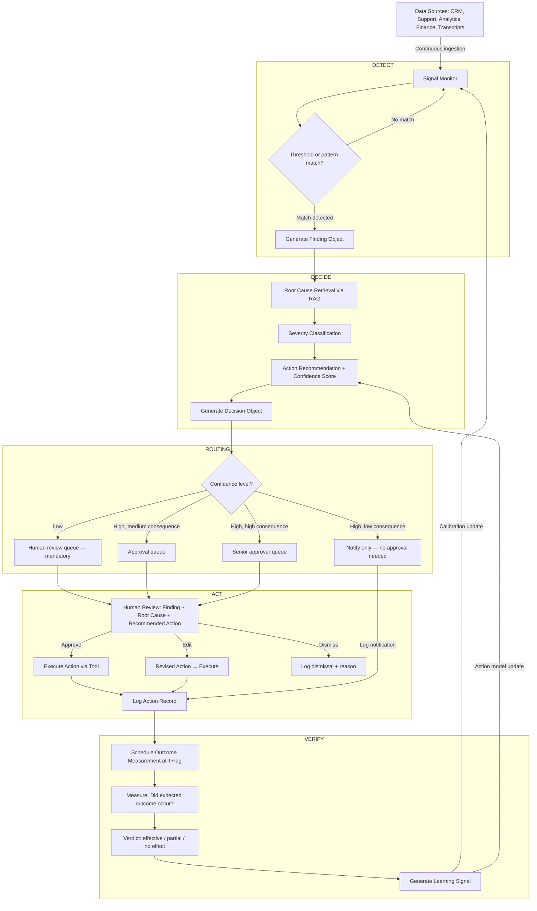

# The DETECT → DECIDE → ACT → VERIFY Loop

**The Core Agentic Architecture Pattern for Enterprise Operational Intelligence**

---

## Overview

The DETECT → DECIDE → ACT → VERIFY (DDAV) loop is a four-phase architecture pattern for enterprise AI agents that need to monitor systems, form judgments, take actions, and confirm outcomes. It is the most important pattern to understand for building AI products that are trustworthy in high-stakes enterprise contexts.

Most AI feature additions to enterprise software implement only the first two phases: detect a signal, suggest an action. The DDAV loop is distinctive because it explicitly includes ACT (with human governance) and VERIFY (was the action effective?). Without VERIFY, the agent has no feedback loop. Without ACT, it is a dashboard. The full loop is what turns a recommendation engine into an operational intelligence system.

---

## The Four Phases

### DETECT: Signal Monitoring and Anomaly Recognition

The DETECT phase monitors defined data sources, continuously or on a schedule, for signals that match a pattern indicating something requires attention.

**What it detects:**
- Threshold crossings (usage drops below X, ticket volume exceeds Y)
- Pattern anomalies (the normal pattern for this entity at this time is Z; today it is W)
- Missing signals (the expected event did not happen — a renewal conversation that should have started two weeks ago has not been initiated)
- Multi-signal combinations (no single signal is alarming, but the combination of three signals matches a historical churn pattern)

**Detection design decisions:**
- **What to monitor:** Defined by the product team based on known risk patterns and business context. Not everything should be monitored — only signals with known actionable interpretations.
- **Detection frequency:** Real-time (event-driven), near-real-time (polling every N minutes), or batch (daily/weekly). Frequency is a cost-quality tradeoff. Real-time for high-consequence signals; batch for low-urgency synthesis.
- **Sensitivity calibration:** Too sensitive → too many alerts → alert fatigue. Too insensitive → misses important signals. Calibrate against historical data to minimise false positives at an acceptable false negative rate.

**Output of DETECT:** A structured finding object: {signal_type, entity_id, current_value, expected_value, deviation_magnitude, confidence, supporting_evidence, timestamp}

---

### DECIDE: Assessment, Root Cause, and Action Recommendation

The DECIDE phase takes the finding from DETECT and forms a judgment: what does this signal mean, what is the most likely root cause, and what action (if any) is recommended?

**What it decides:**
- **Severity classification:** Is this finding urgent (act today), important (act this week), or monitoring (keep watching)?
- **Root cause hypothesis:** Why is this happening? The agent retrieves related context (prior interactions, historical patterns, adjacent signals) and generates the most likely explanation.
- **Recommended action:** What should a human do in response? This is always a recommendation, not a command. The agent does not decide; it advises.
- **Confidence level:** How confident is the agent in its root cause hypothesis and recommended action? Low confidence should trigger human review, not autonomous action.

**DECIDE design decisions:**
- **Root cause reasoning vs. correlation:** The agent should be explicit when it is providing a correlation ("support tickets increased after the last product release") vs. a causal hypothesis ("the ticket increase appears to be caused by the new export feature, based on ticket topic analysis"). Do not present correlations as causes.
- **Competing hypotheses:** When multiple root causes are plausible, present all of them ranked by likelihood. Do not suppress alternatives.
- **Action specificity:** A recommended action should be specific enough to act on ("Schedule a check-in call with the account owner and ask about their experience with the new reporting feature") not generic ("Follow up with the customer").

**Output of DECIDE:** A decision object: {finding_id, severity, root_cause_hypothesis, alternative_hypotheses, recommended_action, confidence, evidence_citations, escalation_path}

---

### ACT: Governed Execution with Human-in-the-Loop

The ACT phase executes the recommended action — with a governance layer that ensures the right level of human oversight based on the action's consequence level.

**What it does:**
- Routes the decision object to the appropriate human (or acts autonomously for pre-approved low-consequence actions)
- Presents the finding, root cause, and recommended action in a review interface
- Waits for human approval, edit, or dismissal
- Upon approval, executes the action via the appropriate tool (API call, notification, CRM update, email draft)
- Logs the action, the approver, and the timestamp

**ACT design decisions:**
- **Who approves:** Not all approvals should go to the same person. A low-severity account health alert goes to the CSM. A high-severity risk finding goes to the CS manager. A billing anomaly goes to finance ops.
- **Approval latency SLA:** Some actions need to be taken within 2 hours; others within 2 days. The ACT phase should communicate urgency and track SLA adherence.
- **Delegated approval:** If the primary approver is unavailable, who is the fallback? This should be defined in the governance configuration, not improvised at runtime.
- **Bulk approval:** For low-urgency items, allow batch review and approval to reduce overhead. Require individual review for high-severity items.
- **Undo capability:** For any action that can be undone, provide an undo window (30 minutes, 24 hours) with a visible undo option in the audit log.

**Output of ACT:** An action record: {decision_id, action_taken, action_executor (human or system), approval_by, approval_timestamp, execution_timestamp, execution_status, undo_available}

---

### VERIFY: Outcome Measurement and Loop Closure

The VERIFY phase measures whether the action taken in ACT produced the intended outcome. This is the phase most commonly omitted and the phase that is most critical for building a system that compounds in value over time.

**What it verifies:**
- **Expected outcome:** What was the intended result of the action? (Defined at DECIDE time: "Expected outcome: customer responds to check-in within 5 days and health score stabilises")
- **Outcome measurement:** Did the expected outcome occur? (Check at T+5 days: did the customer respond? Did the health score change?)
- **Verdict:** Action effective / partially effective / no effect / counterproductive
- **Learning signal:** Feed the verdict back into the system as a labeled example: {finding, recommended_action, outcome}. Over time, this builds a labeled dataset of which actions were effective in which contexts.

**VERIFY design decisions:**
- **Outcome definition at DECIDE time:** The expected outcome must be defined before the action is taken, not after. If the expected outcome is defined after observing the result, it is rationalisation, not measurement.
- **Measurement lag:** Some outcomes are measurable in hours (did the customer open the email?); others in weeks (did the health score recover?). The VERIFY phase must handle multiple measurement horizons.
- **Counterfactual problem:** The VERIFY phase cannot know what would have happened if the action had not been taken. Do not overstate the causal conclusion. "The customer responded within 2 days" is a factual observation. "The action caused the customer to respond" is an inference.
- **Feedback to DETECT and DECIDE:** Verified outcomes feed back into the detection sensitivity calibration (if an action type consistently fails to produce the expected outcome, the DECIDE phase's confidence in that action type should decrease) and the action recommendation model.

**Output of VERIFY:** A verification record: {action_id, expected_outcome, measurement_timestamp, actual_outcome, verdict, evidence, learning_signal_label}

---

## Full DDAV Loop Architecture

```
[DATA SOURCES] (continuous ingestion)
CRM · Support · Product Analytics · Finance · Transcripts
                    ↓
[DETECT LAYER]
Signal monitoring with configurable thresholds and patterns
                    ↓
Finding Object → {signal_type, entity_id, deviation, confidence}
                    ↓
[DECIDE LAYER]
Root cause retrieval (RAG over historical patterns)
Severity classification
Action recommendation with confidence score
                    ↓
Decision Object → {severity, root_cause, recommended_action, confidence, citations}
                    ↓
[ROUTING LAYER]
Low confidence → Human review queue (mandatory)
High confidence, low consequence → Notify only
High confidence, medium consequence → Approval queue
High confidence, high consequence → Senior approver queue
                    ↓
[ACT LAYER — with HITL]
Human reviews finding + root cause + recommended action
Human approves / edits / dismisses
On approval: execute action via tool
Log: action, approver, timestamp
                    ↓
Action Record → {action_taken, approval_by, execution_status}
                    ↓
[VERIFY LAYER]
At T+[measurement_lag]: measure outcome against expected outcome
Verdict: effective / partial / no effect / counterproductive
Feed verdict into detection calibration and action recommendation model
                    ↓
Learning Signal → back to DETECT and DECIDE layers (compounding loop)
```

---

## Mermaid Diagram



---

## DDAV in Practice: Customer Success Example

**DETECT:** Account X's product usage dropped 22% in the last 14 days (threshold: >15% drop triggers finding). Support ticket volume for Account X increased 40% in the same period. Combination pattern matches "pre-churn signal cluster" with 74% historical match rate.

**DECIDE:** Root cause retrieval surfaces: the last call with Account X (Gong, 3 weeks ago) included customer mention of "slow exports." Related Jira ticket #4412 (open for 6 weeks) describes a performance regression in the export feature. Most likely root cause: performance regression is degrading the customer's primary use case. Recommended action: CSM to schedule a technical check-in call and loop in the engineering contact. Expected outcome: customer acknowledges the issue is being addressed; health score stabilises within 30 days. Confidence: 0.81.

**ACT:** Finding routed to the CSM's approval queue with severity "High." CSM reviews: finding, root cause, evidence (Gong clip, Jira ticket), recommended action. CSM edits the recommended action to add "also CC the VP of Engineering" (they know the account contact prefers technical contacts). CSM approves. System drafts the check-in calendar invite and routes it to the CSM's Outreach sequence. CSM sends.

**VERIFY:** At T+7 days: customer responded to the check-in within 48 hours. At T+30 days: health score is stable, support ticket volume returned to baseline. Verdict: Effective. Learning signal: "Performance regression + usage drop pattern → technical check-in with engineering copy" is an effective intervention for this customer tier and product area. Signal added to action recommendation model.

---

## When to Use Each Phase Independently

Not every enterprise AI product needs the full loop. You can implement the DDAV phases incrementally:

| Phases Implemented | Product Type |
|---|---|
| DETECT only | Alert dashboard, monitoring tool |
| DETECT + DECIDE | Recommendation engine, insight surfacing tool |
| DETECT + DECIDE + ACT | Operational AI with human approval |
| Full DDAV | Operational intelligence platform with compounding value |

Start with DETECT + DECIDE. The VERIFY phase requires the most engineering investment and the most discipline to instrument correctly — but it is also what creates compounding value and competitive differentiation.

---

## Guardrails

- **VERIFY is not optional once ACT is deployed:** If the system takes actions, it must measure whether those actions worked. Without VERIFY, you are taking actions in the dark.
- **Expected outcome defined before ACT, not after:** Define the measurement and the success criterion in the DECIDE phase. Do not define it after observing the result.
- **Confidence thresholds are configurable and documented:** Every routing decision based on confidence level should be documented, logged, and periodically reviewed against actual outcome rates.
- **No action is irreversible without additional approval:** If an action is irreversible (cancel a contract, delete an account, send a mass communication), it requires a separate confirmation step beyond the standard approval.
- **Learning signals require human annotation for high-consequence actions:** Do not use automated VERIFY verdicts as training signals for high-consequence action types without human review of a sample.

---

## Success Metrics

| Metric | Phase | Description |
|---|---|---|
| Signal-to-noise ratio | DETECT | % of detections that lead to meaningful approved actions vs. total detections |
| Root cause accuracy | DECIDE | % of root cause hypotheses rated as correct by the human approver |
| Action approval rate | ACT | % of routed decisions that are approved (vs. dismissed or edited substantially) |
| Outcome achievement rate | VERIFY | % of verified actions where the expected outcome was achieved |
| Feedback loop lag | VERIFY | Time from action execution to verified outcome — measures how quickly the system learns |
| Model improvement rate | Full loop | Does the detection and recommendation quality improve over time as learning signals accumulate? |

---

*See also: [Single-Agent Pattern](/agent-workflow-blueprints/single-agent-pattern.md) · [Multi-Agent Operating Loop](/agent-workflow-blueprints/multi-agent-operating-loop.md) · [AI Field Consultant Agent](/agent-workflow-blueprints/ai-field-consultant-agent.md) · [Customer Success Agent](/agent-workflow-blueprints/customer-success-agent.md)*
