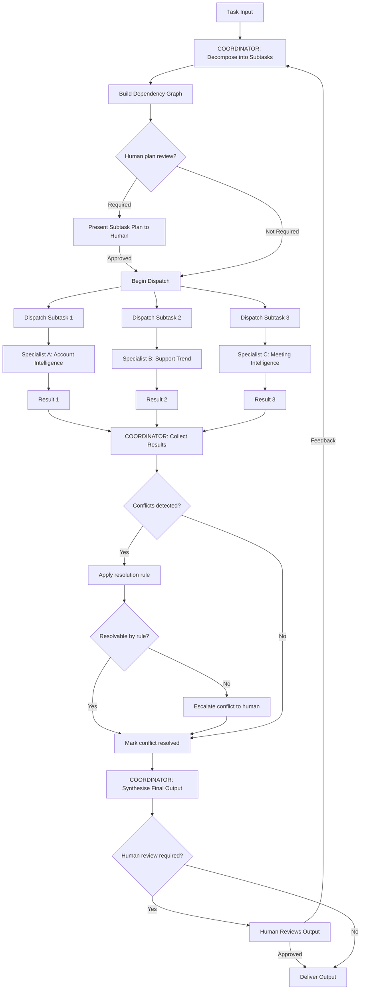

# Multi-Agent Operating Loop: Coordinator + Specialist Agents

---

## Overview

The multi-agent operating loop extends the single-agent and planner-executor patterns to a system where a Coordinator agent orchestrates a network of Specialist agents. Each specialist has a defined domain, a specific tool set, and a narrow goal. The Coordinator receives a high-level task, decomposes it into subtasks, routes each subtask to the appropriate specialist, collects results, resolves conflicts, and assembles the final output.

This pattern enables parallelism, specialisation, and fault isolation. It is the architecture underpinning most enterprise-grade AI product systems — including NexusOS, ProductPilot, and SuccessOS in this portfolio.

---

## Use Case

**Best suited for:**
- Tasks that span multiple domains (CRM + support + product analytics + finance)
- Tasks with independent subtasks that can run in parallel to reduce latency
- Tasks where different subtasks benefit from meaningfully different prompting strategies or tool sets
- Long-running workflows where partial results from specialist agents are available and useful before all specialists complete
- Systems where fault isolation is important — one specialist failing should not take down the whole system

**Not suited for:**
- Simple single-domain tasks where one specialist is all that is needed (use a single agent)
- Tasks with fully sequential dependencies where no parallelism is possible (use planner-executor)
- Systems where the cost of the coordination layer exceeds the benefit of specialisation

---

## Agent Goal

**Coordinator goal:** Decompose the incoming task into subtasks. Route each subtask to the appropriate specialist. Collect and validate results. Detect and resolve conflicts between specialist outputs. Assemble the final output with full provenance.

**Specialist goal:** Complete a specific, narrow subtask reliably within the given scope and tool set. Report results in a structured schema. Escalate to the Coordinator if the subtask is out of scope or fails.

---

## Inputs

**To the Coordinator:**
- Task specification (natural language or structured)
- Available specialist registry (which specialists exist and what they can do)
- Constraints (total budget, time limit, scope)
- Shared context (user identity, session state, relevant background)

**To each Specialist (per subtask dispatch):**
- Subtask specification: goal, input data, expected output schema, deadline
- Scoped context (only what the specialist needs — not the full coordinator context)
- Tool access limited to the specialist's domain

---

## Coordinator Decision Logic

```
COORDINATOR LOOP:
│
├── Receive task + context
│
├── DECOMPOSE: identify subtasks and dependencies
│   Each subtask: {id, goal, specialist_type, inputs, expected_output, priority, dependencies}
│
├── DISPATCH: route subtasks to specialists
│   ├── Independent subtasks → dispatch in parallel
│   └── Dependent subtasks → dispatch after prerequisite subtask completes
│
├── COLLECT: receive specialist results as they complete
│   For each result:
│   ├── Validate against expected_output schema
│   ├── Check for conflicts with other specialist results
│   └── Log result with provenance (specialist_id, timestamp, confidence)
│
├── CONFLICT RESOLUTION: if two specialists produce contradictory outputs
│   ├── Identify conflict
│   ├── Apply resolution rule (recency > certainty > specialist hierarchy)
│   ├── Or: escalate conflict to human for resolution
│
├── SYNTHESISE: combine specialist outputs into final output
│   Citation: every claim in the final output attributed to the specialist and source that produced it
│
└── RETURN final output (or queue for human review)

SPECIALIST LOOP:
│
├── Receive subtask specification
├── Execute using available tools
├── Return: {subtask_id, status, output, confidence, citations, error_detail (if failed)}
```

---

## Specialist Agent Roster (NexusOS Example)

| Specialist | Domain | Key Tools | Output |
|---|---|---|---|
| Account Intelligence | CRM signals | CRM API, deal history retrieval | Account health card |
| Portfolio Risk | Multi-account risk | Health scoring, threshold detection | Risk ranking list |
| Support Trend | Support analytics | Ticket retrieval, sentiment analysis | Trend report |
| Deal Intelligence | Sales pipeline | CRM API, stage velocity calculation | Deal health flags |
| Meeting Intelligence | Call transcripts | Transcript retrieval, extraction | Meeting summary + commitments |
| Financial Anomaly | Billing/contract | Finance API, anomaly detection | Anomaly flags |
| Product Impact | Release correlation | Product analytics API, ticket correlation | Impact report |
| Expansion Signal | Growth signals | Usage analytics, CRM, meeting notes | Expansion brief |

---

## Shared Memory and State

Multi-agent systems require a shared state layer that is accessible to all agents:

**Shared memory types:**

| Type | Description | Implementation |
|---|---|---|
| Task state | Current status of the overall task and each subtask | External database (e.g., Redis or task queue) |
| Specialist results | Outputs from completed specialists | Append-only results store with subtask_id key |
| Conflict log | Detected conflicts between specialist outputs | Structured log with conflict_type, agents_involved, resolution |
| Audit log | All agent actions with timestamps | Append-only audit log (immutable) |
| Agent context cache | Shared context available to all agents | Key-value store keyed by context_type |

**Important:** Specialists should not read each other's outputs during execution. They receive their subtask and return their result. The Coordinator is the only agent that reads all specialist results. This prevents specialists from being influenced by potentially incorrect outputs from other specialists.

---

## Handoff Design

A handoff is the transfer of a subtask from the Coordinator to a Specialist, or from the Specialist back to the Coordinator.

**Handoff schema:**
```json
{
  "subtask_id": "uuid",
  "from_agent": "coordinator",
  "to_agent": "account_intelligence",
  "task_type": "generate_account_health_card",
  "inputs": {
    "account_id": "ACC-001",
    "time_range_days": 90
  },
  "expected_output_schema": "account_health_card_v1",
  "deadline_ms": 30000,
  "priority": "high",
  "retry_policy": {
    "max_retries": 2,
    "backoff_ms": 1000
  }
}
```

**Result schema:**
```json
{
  "subtask_id": "uuid",
  "from_agent": "account_intelligence",
  "status": "success | failure | timeout | out_of_scope",
  "output": { ... },
  "confidence": 0.87,
  "citations": ["source_1", "source_2"],
  "latency_ms": 1842,
  "error_detail": null
}
```

---

## Conflict Resolution

Specialist agents may produce conflicting outputs about the same entity. Example: the Account Intelligence specialist reports that Account X has a health score of 72 (stable), while the Support Trend specialist reports that support ticket volume for Account X has spiked 80% in the last 30 days.

This is not an error — it is the system detecting a tension that a human should resolve. The Coordinator's job is to surface this tension, not suppress it.

**Conflict resolution rules (in priority order):**

1. **Temporal priority:** If one specialist's data is more recent, prefer it. Flag the older data as potentially outdated.
2. **Certainty priority:** If one specialist reports a higher confidence score, weight its output more heavily in the synthesis. Report the lower-confidence data with a flag.
3. **Specialist hierarchy:** Some domain signals are definitionally more authoritative. Product usage data is more authoritative than inferred usage from support ticket topics. Define the hierarchy explicitly in the Coordinator's configuration.
4. **Escalation:** If no resolution rule produces a clear answer, surface both outputs to the human user with the conflict flagged. Do not synthesise a false consensus.

---

## Human Approval Points

Multi-agent systems can have HITL checkpoints at multiple levels:

| Level | Checkpoint | Trigger |
|---|---|---|
| Task level | Pre-execution plan review | All specialist plans reviewed before any specialist executes |
| Specialist level | Specialist action approval | Specific high-consequence actions within a specialist loop |
| Synthesis level | Final output review | Human reviews synthesised output before delivery |
| Conflict level | Conflict resolution | Human resolves a conflict that the Coordinator cannot resolve by rule |
| Escalation | Specialist failure | Specialist fails and the Coordinator cannot proceed without that output |

For most enterprise deployments, start with task-level and synthesis-level HITL. Add specialist-level HITL for any specialist that takes irreversible actions.

---

## Autonomy Level

The Coordinator can enforce different autonomy levels per specialist:

| Specialist | Recommended Autonomy (Starting) |
|---|---|
| Read-only specialists (Account Intelligence, Meeting Intelligence) | Execute autonomously; include in synthesised output |
| Low-consequence write specialists (update task status, add tag) | Execute autonomously; log |
| Medium-consequence (send internal notification) | Execute with async notification to supervisor |
| High-consequence (send external email, update permissions) | Require explicit human approval before execution |

---

## Failure Modes

| Failure Mode | Description | Mitigation |
|---|---|---|
| Coordinator bottleneck | Coordinator becomes the single point of failure; if it fails, all specialists are stuck | Coordinator state persisted externally; stateless restart possible |
| Specialist timeout | Specialist does not return within deadline | Timeout handling in handoff schema; Coordinator proceeds with available results and flags missing specialist |
| Cascading specialist dependency failure | Specialist B depends on Specialist A's output; A fails; B cannot proceed | Explicit dependency graph; graceful handling of missing upstream outputs |
| Coordinator hallucination | Coordinator dispatches a subtask to the wrong specialist | Specialist capability registry validated against accepted task types; specialist rejects out-of-scope tasks |
| Synthesis confusion | Coordinator synthesises conflicting outputs into a false consensus | Conflict detection before synthesis; never synthesise conflicting claims |
| Token cost explosion | Multi-agent system uses 10× more tokens than expected due to coordination overhead | Token budget per agent per session; coordinator limits context passed to each specialist |

---

## Guardrails

- **Specialist scope enforcement:** Each specialist's tool set is restricted to its domain. Account Intelligence cannot write to the support ticket system.
- **Coordinator cannot execute directly:** The Coordinator dispatches and synthesises. It does not call domain tools directly. This ensures clean separation of concerns.
- **Subtask budget:** Maximum number of subtasks per Coordinator session.
- **Parallel execution limit:** Maximum number of specialists running simultaneously (to control cost and rate limiting).
- **Immutable audit log:** Every subtask dispatch, result, conflict, and resolution is logged immutably.
- **Failure threshold:** If >30% of specialists in a session fail, the Coordinator halts and escalates to human.

---

## Success Metrics

| Metric | Description |
|---|---|
| Overall task completion rate | % of multi-agent tasks where all required specialists complete |
| Specialist success rate | Per-specialist success rate (identifies reliability issues by domain) |
| Coordinator synthesis quality | Human reviewer rating of final synthesised output (sampled) |
| Conflict detection rate | % of sessions where at least one conflict is detected and surfaced |
| Parallelism efficiency | Actual latency vs. theoretical latency if fully sequential (measures parallelism gain) |
| HITL escalation rate | % of tasks requiring human intervention at any level |

---

## Mermaid Diagram



---

*See also: [Single-Agent Pattern](/agent-workflow-blueprints/single-agent-pattern.md) · [Planner-Executor Pattern](/agent-workflow-blueprints/planner-executor-pattern.md) · [Detect-Decide-Act-Verify Loop](/agent-workflow-blueprints/detect-decide-act-verify-loop.md)*
