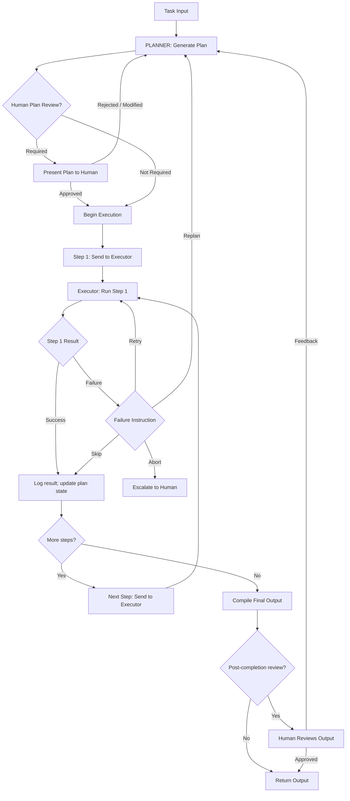

# Planner-Executor Pattern: Structure, Tradeoffs, and B2B SaaS Applications

---

## Overview

The planner-executor pattern separates the cognitive work of deciding what to do from the execution work of doing it. The Planner generates a step-by-step plan for completing a task. The Executor runs each step in sequence (or in parallel), reporting results back to the Planner. The Planner adjusts the plan based on intermediate results.

This pattern is particularly valuable in B2B SaaS when tasks are complex and multi-step, when intermediate results determine what subsequent steps should be, and when you want to audit the full plan before any execution begins.

---

## Use Case

**Best suited for:**
- Complex tasks with 5+ sequential steps where each step's output informs the next
- Tasks where a human needs to review the plan before execution begins (enterprise workflows with HITL requirements)
- Tasks where some steps are more expensive or risky than others and should be sequenced to fail early on cheap steps before expensive ones
- Research and synthesis workflows: gather information, synthesise, then draft output

**Not suited for:**
- Simple single-step tasks (overhead is not worth it)
- Fully reactive tasks where the next action cannot be planned in advance (use a single reactive agent)
- Tasks requiring real-time response (<500ms latency budget — the planning step adds too much overhead)

---

## Agent Goal

**Planner goal:** Decompose the high-level task into a sequence of executable steps, each with a defined input, expected output, and failure handling instruction.

**Executor goal:** Execute each assigned step reliably, returning structured results (success/failure, output, error detail) to the Planner for each step.

---

## Inputs

**To the Planner:**
- High-level task description (natural language or structured)
- Available tool manifest (what the Executor can do)
- Constraints (time budget, cost budget, scope restrictions)
- Prior context (relevant background information)

**To the Executor:**
- Step specification from the Planner: step_id, action, parameters, expected_output_schema, failure_instruction
- Tool access credentials and scope

---

## Tools Available

**Planner tools:**
- plan_generator: Generates a structured plan (array of steps)
- plan_validator: Validates the plan against constraints (step count, feasibility)
- plan_updater: Modifies the plan based on Executor results

**Executor tools (per step type):**
- retrieve(query, scope): Retrieval from knowledge base or data store
- read_record(entity_type, entity_id): Read structured data
- write_record(entity_type, entity_id, fields): Write structured data
- call_api(endpoint, params): Call an external API
- generate_content(prompt, schema): Generate structured content via LLM
- notify_human(user_id, message, urgency): Send notification to a human user
- request_approval(action_details, approver_role): Request human approval

---

## Memory Model

**Planner memory:**
- In-context: Full plan + all Executor results so far
- Persistent: Plan state (for long-running tasks that may be interrupted)

**Executor memory:**
- In-context: Current step specification + result of current tool call
- The Executor does not need to see the full plan — just the current step. This limits context window usage and reduces the risk of the Executor being confused by irrelevant context.

**Shared state:**
- Plan object: stored externally (database or queue), referenced by both Planner and Executor
- Step results: appended to the plan object as each step completes

---

## Retrieval Sources

**Planner retrieval:** Background context documents, tool capability descriptions, prior plans for similar tasks (from plan catalog, if one exists)

**Executor retrieval (step-specific):** Scoped per step to the relevant data sources — not the full corpus. The step specification should include the retrieval scope as an explicit parameter.

---

## Decision Logic

```
PLANNER:
│
├── Receive task + context
├── Generate plan: [Step 1, Step 2, ..., Step N]
│   Each step: {id, action, params, expected_output, failure_instruction}
│
├── [Optional: Human plan review before execution]
│
├── For each step in plan:
│   ├── Send step to Executor
│   ├── Receive Executor result
│   ├── Evaluate result:
│   │   ├── Success → continue to next step (or update plan if result changes what's needed)
│   │   └── Failure → follow failure_instruction:
│   │       ├── retry → re-send step with error context
│   │       ├── skip → continue to next step, note failure
│   │       ├── abort → halt plan, escalate to human
│   │       └── replan → generate updated plan based on new information
│   └── Mark step as complete
│
└── All steps complete → compile final output → return

EXECUTOR:
│
├── Receive step specification
├── Execute action via tool call(s)
├── Return: {step_id, status, output, error_detail (if failed)}
```

---

## Human Approval Points

In B2B SaaS enterprise contexts, the most valuable HITL checkpoint for the planner-executor pattern is **plan review before execution begins**. This is a uniquely powerful control mechanism: a human can see the entire plan, understand what the agent intends to do, and approve or modify the plan before any action is taken.

| Checkpoint | Description | Recommended for |
|---|---|---|
| Pre-execution plan review | Human reviews and approves the plan before Step 1 begins | High-stakes or irreversible workflows |
| Pre-step approval for flagged steps | Human approves specific high-risk steps before Executor runs them | Mixed-autonomy workflows |
| Post-step notification for write steps | Human notified after each write action, with rollback window | Medium-stakes workflows |
| Post-completion review | Human reviews the full output after all steps complete | Output quality control |

**Pattern for enterprise adoption:** Start with plan-review HITL + post-completion review. Remove the post-completion review once the Planner's plan quality and Executor's reliability are established. Move to async plan review (plan is queued, human reviews within an SLA rather than synchronously) once the team trusts the system.

---

## Autonomy Level

The planner-executor pattern naturally accommodates a tiered autonomy model:

| Level | Behaviour |
|---|---|
| 1 — Plan + confirm | Generate plan, present to human, wait for approval before any execution |
| 2 — Plan + execute low-risk, confirm high-risk | Execute low-consequence steps autonomously; pause for human approval on flagged steps |
| 3 — Plan + execute + notify | Execute all steps autonomously; send notification after each significant action |
| 4 — Plan + execute autonomously | Full autonomous execution; human reviews final output only |

Most enterprise deployments should start at Level 1 or 2. Level 4 is appropriate only for well-tested, reversible, low-stakes automated workflows.

---

## Failure Modes

| Failure Mode | Description | Mitigation |
|---|---|---|
| Planner hallucination | Planner generates a step that uses a tool that does not exist or with invalid parameters | Tool manifest validation on plan generation; Executor validates each step before attempting |
| Executor step failure cascade | Step 3 fails; Planner continues to Step 4, which depends on Step 3's output | Step dependency graph in plan; Executor checks preconditions before executing dependent steps |
| Plan drift | Intermediate results change the task context; Planner fails to update the plan accordingly | After each step, Planner evaluates whether the plan needs updating; replan instruction available |
| Context overflow in Planner | Full plan + all prior step results exceed context window | Summarise step results before appending to Planner context; use external state store instead of in-context accumulation |
| Parallel step conflict | If steps are executed in parallel, two steps may attempt to write to the same record | Explicit dependency graph prevents parallel execution of dependent steps; write-locking at the tool layer |

---

## Guardrails

- **Step count budget:** Maximum N steps per plan. Plans exceeding N are rejected by the plan validator with a prompt to simplify.
- **Tool call validation per step:** Before the Executor runs a step, the step parameters are validated against the tool schema.
- **Failure count limit:** If more than M steps fail in a single plan execution, the plan halts and escalates to human.
- **Irreversible step flag:** Any step classified as irreversible (delete, publish, send external communication) requires explicit approval in the plan, regardless of the overall autonomy level.
- **Plan audit log:** Every plan generated, every step executed, and every Executor result is logged with timestamp, agent identity, and session ID.

---

## Success Metrics

| Metric | Description |
|---|---|
| Plan completion rate | % of plans where all steps complete successfully |
| Step success rate | % of individual steps that succeed on first attempt |
| Plan quality score | Human reviewer rating of plan structure and step appropriateness (sampled) |
| Step retry rate | % of steps that require retry — signals which step types have reliability issues |
| Replan frequency | % of plans that require a replan during execution — signals task complexity vs. plan quality |
| Latency | P50/P95 time from task receipt to plan completion |

---

## B2B SaaS Examples

**Customer onboarding automation:**
- Planner decomposes: provision accounts → configure integrations → send welcome sequence → schedule kickoff → create internal project
- Executor runs each step via API calls
- HITL: human reviews plan before execution; human approves the external communication step

**Renewal preparation:**
- Planner: retrieve account health → retrieve call history → identify risks → identify expansion signals → draft renewal brief → draft expansion proposal
- Executor: retrieves from CRM, Gong, product analytics
- HITL: human reviews plan; human approves the expansion proposal section before it's included in the brief

**Support escalation handling:**
- Planner: classify ticket → retrieve similar resolved tickets → draft response → identify if engineering ticket is needed → route appropriately
- Executor: retrieves from ticket history, generates draft
- HITL: human reviews AI-drafted response before sending to customer

---

## Mermaid Diagram



---

*See also: [Single-Agent Pattern](/agent-workflow-blueprints/single-agent-pattern.md) · [Multi-Agent Operating Loop](/agent-workflow-blueprints/multi-agent-operating-loop.md) · [Detect-Decide-Act-Verify Loop](/agent-workflow-blueprints/detect-decide-act-verify-loop.md)*
