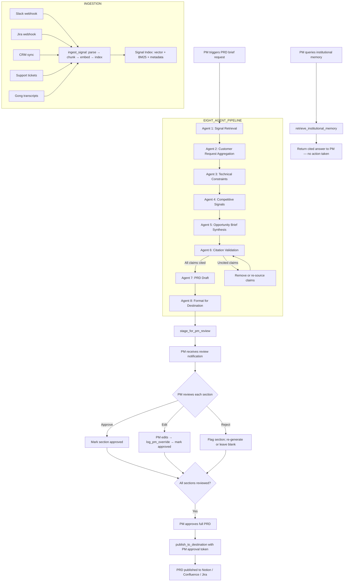

# Product Intelligence Agent Blueprint

**Use case:** Product signal synthesis — transforming scattered signals from Slack, Jira, CRM, support, and interview transcripts into cited opportunity briefs and PRD first drafts, with PM review before any output is published.

---

## Agent Goal

Continuously ingest product signals from all connected sources, synthesise signals into ranked opportunity briefs on demand, generate cited PRD first drafts for PM review, and maintain institutional memory that persists the reasoning behind past prioritisation decisions — with PM approval required before any output is published to a destination.

---

## Inputs

**Continuous (automated ingestion):**
- Slack messages (selected channels)
- Jira ticket updates (selected projects)
- CRM notes and opportunity updates (Salesforce or HubSpot)
- Support tickets (Zendesk or Intercom)
- Call transcripts (Gong or Chorus, post-call)

**On-demand (PM-triggered):**
- PRD brief request: topic (natural language), target_segment (optional), priority_tier (optional)
- Institutional memory query: question (natural language)
- Signal search: product_area, date_range, customer_tier

---

## Tools Available

| Tool | Description | Autonomy |
|---|---|---|
| ingest_signal(source, content, metadata) | Parse, chunk, embed, index a new signal | Automatic |
| retrieve_signals(query, filters) | Hybrid retrieval from signal index | Automatic |
| cluster_customer_requests(product_area, filters) | Group and rank requests by frequency × tier × recency | Automatic |
| retrieve_technical_constraints(product_area) | Surface related Jira items and tech debt | Automatic |
| retrieve_competitive_mentions(product_area) | Extract competitive mentions from corpus | Automatic |
| synthesise_opportunity_brief(signals) | Draft opportunity brief with citation enforcement | Automatic |
| validate_citations(brief_object) | Verify all claims map to cited sources | Automatic |
| draft_prd_sections(brief_object, section_types) | Expand brief into PRD sections | Automatic |
| format_for_destination(prd_object, destination) | Format for Notion/Confluence/Jira | Automatic |
| stage_for_pm_review(pm_id, output_object) | Stage output in PM's review queue | Automatic |
| publish_to_destination(output_id, pm_approval_token) | Publish approved PRD to destination | Requires PM approval |
| log_pm_override(pm_id, section_id, original, edited) | Log PM edit for eval dataset | Automatic |
| retrieve_institutional_memory(query) | RAG over all historical signals for institutional memory | Automatic |

---

## Memory Model

| Memory Type | Content | Storage |
|---|---|---|
| In-context (brief generation) | Retrieved signals for the current PRD request | LLM context window; per-request |
| External signal index | All ingested chunks: source, date, product_area, customer_tier, signal_type | Vector store + BM25 index + metadata |
| Customer request registry | Aggregated and ranked customer requests by product_area | Structured registry, updated on each new request signal |
| Product area taxonomy | PM-team-maintained hierarchy of product area labels | Configuration database |
| Override dataset | PM edits to generated sections, captured as preference pairs | Structured dataset for eval and fine-tuning |
| Institutional memory index | Full signal corpus with temporal index — enables historical queries | Same vector store, unrestricted time window |

---

## Retrieval Architecture

**Retrieval type:** Hybrid (dense semantic + BM25 sparse keyword), merged and reranked

**Retrieval pipeline for each PRD brief request:**
1. Generate 3 query variants from the PM's natural language request (query expansion)
2. For each variant: retrieve top-20 from dense + top-20 from BM25, deduplicate
3. Merge all retrieved chunks, run cross-encoder reranker on merged set
4. Apply metadata filter: product_area tag filter (if topic maps to a known product area)
5. Take top-20 after reranking
6. Order for context assembly: by recency within category; higher-tier customer signals first

**Retrieval scoping:**
- PRD brief: scoped to product_area tag (if mappable) + date range (configurable, default last 180 days)
- Institutional memory: unscoped (full corpus, full time range)
- Customer request clustering: scoped to product_area + customer tier filter

---

## Decision Logic

**Eight-agent pipeline (per PRD brief request):**

```
PM enters: topic + optional target_segment + optional priority_tier
                    ↓
[Agent 1: Signal Retrieval]
retrieve_signals(query=topic, filters={product_area, date_range})
→ top-20 chunks per signal category (customer, technical, competitive)

                    ↓
[Agent 2: Customer Request Aggregation]
cluster_customer_requests(product_area, {tier_filter, date_range})
→ ranked request list: frequency × tier_weight × recency_score
→ top-10 requests with representative customer examples

                    ↓
[Agent 3: Technical Constraint Retrieval]
retrieve_technical_constraints(product_area)
→ related Jira issues (open bugs, tech debt items, prior spike estimates)

                    ↓
[Agent 4: Competitive Signal Retrieval]
retrieve_competitive_mentions(product_area)
→ competitive mentions from transcripts, CRM notes, support tickets

                    ↓
[Agent 5: Synthesis]
synthesise_opportunity_brief({customer_signals, tech_constraints, competitive_signals})
→ structured brief: problem_statement, evidence_summary, user_impact, tech_considerations
→ each claim accompanied by [SOURCE_ID] citation marker

                    ↓
[Agent 6: Citation Validation]
validate_citations(brief_object)
→ for each cited claim: verify source chunk supports the claim
→ flag: supported / not_supported / partially_supported
→ not_supported claims: remove or re-source

                    ↓
[Agent 7: PRD Draft]
draft_prd_sections(brief_object, ["problem", "users", "jtbd", "requirements", "non_goals", "success_metrics"])
→ full PRD draft with inline citations

                    ↓
[Agent 8: Formatting]
format_for_destination(prd_object, pm_destination_config)
→ formatted output ready for Notion/Confluence/Jira

→ stage_for_pm_review(pm_id, formatted_output)
→ PM receives review notification
```

---

## Human Approval Points

| Action | Autonomy | Rationale |
|---|---|---|
| Signal ingestion and indexing | Automatic | Pre-processing; no external effect |
| Product area auto-tagging | Suggestion → PM admin confirmation | Taxonomy accuracy is critical; human confirms new tags |
| PRD brief generation | Automatic (all 8 agents) | Internal pipeline; no effect until PM reviews output |
| PRD section review | PM approval required per section | PM owns the PRD; authorship and accuracy responsibility |
| Full PRD publish | PM approval required | Permanent record; PM must vouch for accuracy |
| Institutional memory query responses | Automatic | Read-only; no downstream effect |
| Override logging | Automatic (with consent) | Transparent; PM can disable per session |

---

## Autonomy Level

**Current design:** Level 1 (Suggest) for all PRD content — the agent generates, the PM decides.

**This is intentional and permanent for PRD outputs.** The product's value proposition is not automation; it is research compression. The PM remains the author. The system is the research assistant.

For internal operations (signal ingestion, auto-tagging suggestions, pipeline monitoring), Level 4 (automatic) is appropriate.

---

## Failure Modes

| Failure Mode | Description | Detection | Mitigation |
|---|---|---|---|
| Low retrieval recall — missing high-priority signals | Key customer requests not indexed or retrieved | Monthly recall eval against golden query set | Improve ingestion coverage; tune retrieval |
| Hallucinated customer request | Agent asserts a request that is not in the index | Citation validation (Agent 6) | Citation enforcement; monthly human eval |
| Stale signals in brief | Index has not refreshed; brief misses recent signals | Data freshness timestamp in brief header | Freshness alert in brief; ingestion monitoring |
| Agent 6 failure (citation validator) | Validator approves uncited claims | Validator's output quality eval (monthly sample) | Run validator twice for high-confidence claims; human review of monthly sample |
| PM over-trust (approves without reading) | PM approves sections without meaningful review | Approval time-per-section (target >30s per section) | UI friction: minimum time-on-section before approve button appears |
| Context window overflow in Agent 5 | Too many retrieved chunks exceed context limit | Token count monitoring before synthesis prompt | Context window management: cap retrieved chunks at synthesis step; summarise if over limit |

---

## Guardrails

- **Citation enforcement is non-negotiable:** Agent 6 is not optional. If citation validation fails, the brief is not shown to the PM. The PM sees only citation-validated outputs.
- **No auto-publish capability:** There is no configuration option that enables automatic publishing to Notion/Confluence/Jira without PM approval. The publish_to_destination tool requires a PM approval token at the API layer.
- **PII handling in transcripts:** Contact names in transcript chunks are redacted at ingestion. The PM can see account-level attribution ("Senior Director at an Enterprise financial services company") without contact-level PII.
- **Competitive mentions handling:** All competitive mentions in the PRD output are marked "[INTERNAL — NOT FOR DISTRIBUTION]". The PRD publish destination must not be a publicly accessible URL.
- **Override logging transparency:** PM override logging is disclosed in the onboarding flow and in the review interface ("Your edits help improve future briefs"). Opt-out available per session.

---

## Success Metrics

| Metric | Target |
|---|---|
| Pipeline runtime | <5 minutes p95 |
| Retrieval recall@10 | >80% on golden eval dataset |
| Citation accuracy | >95% on monthly human eval sample |
| PM brief prep time reduction | 80% reduction (self-reported) |
| PM override rate per section | Tracked; target declining trend over 6 months |
| PRD stakeholder satisfaction | 4.0/5.0+ (engineering, design, CSM rating of PRD completeness) |
| Institutional memory query relevance | >80% of queries rated "relevant or very relevant" by PM (monthly survey) |

---

## Mermaid Diagram



---

*See also: [ProductPilot OS Case Study](/case-studies/productpilot-product-intelligence.md) · [Product Signal Intelligence PRD](/ai-prds/product-signal-intelligence-prd.md) · [RAG System Overview](/rag-workflow-documentation/rag-system-overview.md)*
