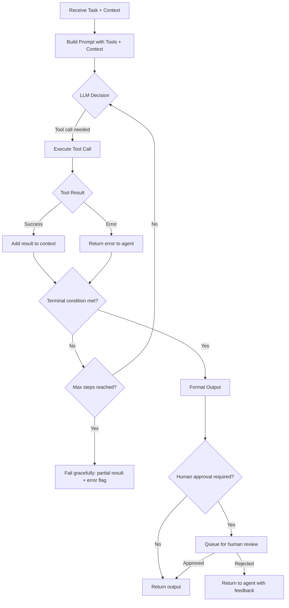

# Single-Agent Pattern: Structure, Tradeoffs, and When to Use

---

## Overview

The single-agent pattern is the simplest viable agentic architecture: one LLM with a defined goal, a set of tools it can call, and a loop that continues until the goal is met or a stop condition is reached. Understanding this pattern deeply — its strengths, failure modes, and the conditions under which it breaks down — is a prerequisite for knowing when to graduate to multi-agent designs.

---

## Use Case

**Best suited for:** Tasks with a single, well-defined goal that can be completed in a bounded number of steps using a fixed tool set. Examples:
- Answering a question from a knowledge base (RAG Q&A)
- Generating a structured document from a template with variable inputs
- Executing a multi-step workflow where each step has clear success/failure criteria
- Monitoring a single data source and triggering an action based on a threshold

**Not suited for:** Tasks requiring parallel execution across many subtasks, specialised expertise in different domains, or tasks where the plan changes substantially mid-execution based on intermediate results.

---

## Agent Goal

A single-agent pattern requires a clearly defined terminal condition. The agent knows it is done when:
- It has produced a specific output (e.g., a JSON object matching a schema), OR
- A specific state has been reached (e.g., a record has been updated in a system), OR
- A maximum number of steps has been reached (fail-safe)

Without a clear terminal condition, single agents loop indefinitely or oscillate between tool calls without making progress.

---

## Inputs

- **Task specification:** The goal, in natural language or structured format
- **Context:** Relevant information the agent needs but cannot retrieve itself (user identity, session state, prior conversation)
- **Tool manifest:** List of available tools with descriptions and input/output schemas
- **Constraints:** Budget (max steps, max token cost), time limit, scope restrictions

---

## Tools Available

A single agent should have access to a well-defined, minimal tool set. Common tool categories:

| Tool Type | Example | When to Include |
|---|---|---|
| Retrieval | search_knowledge_base(query) | When the agent needs to access external information |
| Data read | get_account_record(account_id) | When the agent needs structured data from a system |
| Data write | update_task_status(task_id, status) | When the agent needs to modify state |
| Computation | calculate_risk_score(signals) | When the agent needs deterministic computation |
| Communication | send_notification(user_id, message) | When the agent needs to alert a human |
| Human-in-the-loop | request_approval(action, context) | When the agent needs human approval before proceeding |

**Tool design principle:** Each tool should do one thing. Avoid tool functions that bundle multiple actions (e.g., "update_and_notify" — make these two separate tools). Single-responsibility tools are easier to reason about, debug, and constrain.

---

## Memory Model

Single agents operate with four types of memory:

| Memory Type | Description | Example |
|---|---|---|
| In-context memory | Current conversation and tool call history — lives in the context window | Last 5 tool calls and their results |
| External retrieval | Retrieved documents or records — fetched per query | Customer record from CRM |
| Persistent state | State stored outside the context window, retrieved at session start | User preferences, prior session summary |
| No memory (stateless) | Agent is fully stateless — same input always produces same output | Suitable for simple classification tasks |

For most B2B SaaS use cases, a combination of in-context memory (current session) and external retrieval (knowledge base, records) is sufficient. Persistent state is needed when the agent must remember what it has already done across sessions.

---

## Retrieval Sources

- Primary: vector database (semantic search)
- Secondary: structured database (exact lookup by ID or filter)
- Tertiary: tool call results (retrieved in the course of the agent loop)

Retrieval should be scoped to the task. An agent answering a question about Account X should not be retrieving from the full corpus — it should be scoped to Account X's records. Scope reduces noise and reduces the risk of cross-contamination between accounts.

---

## Decision Logic

```
START
│
├── Receive task + context
│
├── PLAN: Break task into next immediate action
│     (Most single agents do not generate an explicit multi-step plan.
│      They decide one action at a time: "Given my current state, 
│      what is the next tool call that moves me closer to the goal?")
│
├── TOOL CALL → receive tool result
│
├── EVALUATE: Is the terminal condition met?
│   ├── YES → FORMAT OUTPUT → RETURN
│   └── NO → Is max steps reached?
│             ├── YES → FAIL GRACEFULLY → return partial result + error state
│             └── NO → return to PLAN
│
END
```

**Key decision: single-step vs. multi-step planning.** Some single agents generate an explicit plan before taking actions ("I will first retrieve the account record, then check the support history, then generate a summary"). Others are purely reactive ("Given my current state, what do I do next?"). Explicit planning improves debuggability but increases latency and may be unnecessary for simple tasks.

---

## Human Approval Points

Single agents should have defined HITL checkpoints based on the action's consequence level:

| Action Type | HITL Requirement |
|---|---|
| Read-only (retrieval, calculation) | None — fully autonomous |
| Low-consequence write (update a status field, add a tag) | Optional notification |
| Medium-consequence write (send an internal notification, update a record) | Recommended approval for first N uses |
| High-consequence write (send external email, modify permissions, initiate payment) | Always require explicit human approval |
| Irreversible action (delete, cancel, publish) | Always require explicit human approval |

---

## Autonomy Level

**Single-agent autonomy spectrum:**

1. **Suggest:** Agent produces output; human decides whether to use it. (Lowest autonomy)
2. **Draft and wait:** Agent produces output and stages it for human approval before any action.
3. **Execute with notification:** Agent takes action and notifies a human; human can reverse within a time window.
4. **Execute autonomously:** Agent takes action without notification. (Highest autonomy — use only for reversible, low-consequence actions with well-calibrated confidence.)

Most enterprise B2B single-agent deployments should start at level 1 or 2 and graduate to 3 or 4 only after the agent's error rate has been measured and accepted.

---

## Failure Modes

| Failure Mode | Description | Detection | Mitigation |
|---|---|---|---|
| Infinite loop | Agent calls the same tools repeatedly without progress | Step count limit | Max step budget with hard stop |
| Tool hallucination | Agent calls a tool that does not exist or with invalid parameters | Tool call validation | Strict tool manifest with schema validation |
| Goal drift | Agent pursues a subgoal that diverges from the original task | Output quality eval | Clear terminal condition; regular spot checks |
| Context overflow | Task context exceeds context window; oldest context is truncated | Token count monitoring | Context compression or retrieval instead of in-context inclusion |
| Silent failure | Tool call fails silently and agent proceeds as if it succeeded | Tool call error handling | All tool calls return explicit success/failure; agent handles failure states |
| Over-confidence | Agent reports high confidence on an answer that is wrong | Calibration eval | Confidence scores calibrated against eval dataset |

---

## Guardrails

- **Max step budget:** Hard limit on the number of tool calls per session. When exceeded, agent halts and returns a partial result with a flag.
- **Tool call validation:** All tool calls validated against the tool schema before execution. Invalid parameters rejected with an error returned to the agent.
- **Scope enforcement:** Retrieval and data write tools enforce scope at the tool layer, not the prompt layer. If the agent is scoped to Account X, the retrieval tool's API enforces that filter regardless of what the agent requests.
- **Output schema validation:** If the terminal output must conform to a schema (JSON, structured object), validate before returning. If validation fails, re-prompt.
- **Human escalation path:** If the agent cannot complete the task within the step budget or encounters an unrecoverable error, it escalates to a human with the partial result and the reason for escalation.

---

## Success Metrics

| Metric | Description |
|---|---|
| Task completion rate | % of tasks completed successfully within the step budget |
| Step efficiency | Average steps per task vs. theoretical minimum |
| Tool error rate | % of tool calls that return an error |
| Output accuracy | % of outputs that pass human quality review (sampled) |
| Latency | P50/P95 time from task start to output |
| HITL escalation rate | % of tasks that require human intervention |

---

## Tradeoffs vs. Multi-Agent

| Dimension | Single Agent | Multi-Agent |
|---|---|---|
| Simplicity | High | Lower |
| Debuggability | High (one execution trace) | Lower (multiple traces, coordination layer) |
| Cost | Lower (one model context) | Higher (multiple models, coordination tokens) |
| Latency | Lower | Higher (coordination overhead) |
| Parallelism | None | Possible |
| Specialisation | Limited (one model handles all subtasks) | High (specialist agents per subtask) |
| Failure isolation | Low (single point of failure) | High (one agent failure does not necessarily fail all) |

**Rule of thumb:** Start with a single agent. Graduate to multi-agent when: (1) the task has independent subtasks that can run in parallel, (2) different subtasks require meaningfully different prompting strategies or tool sets, or (3) the context window is consistently full because the task requires too many tool results to fit.

---

## Mermaid Diagram



---

*See also: [Planner-Executor Pattern](/agent-workflow-blueprints/planner-executor-pattern.md) · [Multi-Agent Operating Loop](/agent-workflow-blueprints/multi-agent-operating-loop.md) · [Detect-Decide-Act-Verify Loop](/agent-workflow-blueprints/detect-decide-act-verify-loop.md)*
